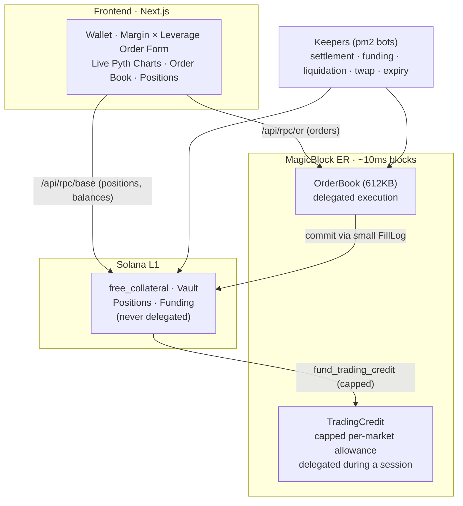

<h1 align="center">Slipstream</h1>
<p align="center">
  
</p>

<p align="center">
  <a href="https://slipstream.ansht.tech"><strong>🌐 Live demo</strong></a> &nbsp;·&nbsp;
  <a href="https://slipstream.ansht.tech/docs">📚 Docs</a>
</p>

<p align="center">
  <a href="https://github.com/Ansh-699/SlipStream/actions/workflows/ci.yml"></a>
  
  
</p>

<p align="center">
  <strong>On-chain perpetual-futures CLOB on Solana  order matching at rollup speed, custody at L1 security.
  Devnet MVP deployed and verified on Solana devnet + the MagicBlock devnet Ephemeral Rollup.</strong>
</p>

<p align="center">
  <em></em>
</p>


---

## What it is

Slipstream is an **on-chain perpetual-futures exchange** built around a **central-limit
order book (CLOB)** — the same price-time-priority matching model real exchanges use,
not an AMM. It tracks **SOL/USD** with leverage up to 20×, funding, and liquidations.

The hard problem it solves: a real CLOB needs thousands of fast, cheap order updates,
which Solana's base layer (L1) can't host directly — but L1 *can* custody money safely.
Slipstream **splits the system**:

- **Order matching** runs inside a [MagicBlock](https://www.magicblock.gg/) **Ephemeral
  Rollup (ER)** at ~10 ms — fast, sponsored, ideal for high-frequency quoting.
- **All value-bearing state** (collateral, positions, the token vault, funding) stays on
  **Solana L1**, where it is never delegated and therefore never at risk from the ER.

> **The one safety fact that matters:** delegation to the ER is capped, not unlimited.
> The 612 KB **OrderBook** (non-financial — order metadata only) is delegated forever.
> The only value-bearing account that's ever delegated is **TradingCredit** — a
> per-market allowance the user explicitly funds and caps (`fund_trading_credit`),
> never their whole balance. `UserAccount.free_collateral`, `Position`, and the token
> vault stay on L1 and are never delegated. A misbehaving ER can at worst scramble
> order *ordering* or misuse a session's capped credit allowance — it can never reach
> the vault or a user's un-delegated balance.

## What it does

| Capability | Status |
|---|---|
| Limit + market orders, price-time-priority matching in the ER |  live |
| Margin × leverage (up to 20×), real notional/PnL accounting |  live |
| ER → L1 settlement into real `Position` accounts (FillLog pipeline) |  live |
| Partial close + slippage-bounded close-at-market |  live |
| Stop-loss / take-profit trigger orders (keeper-executed on-chain) |  live, keeper-cranked |
| Funding rate (8h interval, self-computed 30-min TWAP) |  live, keeper-cranked |
| Liquidations (health factor, liq price) |  live, keeper-cranked |
| Session keys (sign once, trade many — no popup per order) |  live |
| Live Pyth price chart (SSE stream + real OHLC history) |  live |
| Settled-trade history + system-status panel (SQLite fills indexer) |  live |
| On-chain order book held in a single ~612 KB PDA |  live |
| CI (clippy `-D warnings`, mollusk program tests, tsc + eslint) |  green |

## How it does it



- **Program** (`programs/`): written in **Pinocchio** (minimal, zero-dep Solana SDK).
  The 612 KB order book is one flat `#[repr(C)]`/`Pod` account read via **zero-copy**
  slices and grown in 10 KB chunks (Solana's per-CPI growth cap). 40 instructions,
  including keeper-executed SL/TP triggers and a mark-price freshness gate that
  refuses to settle closes off a stale/dead price feed.
- **Settlement** (`FillLog` pipeline): because the 612 KB book can't be committed to L1
  (size cap + a verified 10-commit-per-account limit), a tiny ~8 KB epoch-rotatable
  FillLog carries fills L1-ward: `mirror_fills` (ER) → `commit_fill_log` (ER→L1) →
  `settle_from_log` (L1). The book stays delegated forever, never committed.
- **Client SDK** (`client/`): PDA derivation, account decoders, instruction builders.
- **Keepers** (`keepers/`): off-chain bots that crank funding, liquidation, TWAP, expiry,
  and the settlement pipeline.
- **Frontend** (`frontend/`): Next.js app; routes all RPC through same-origin proxies to
  avoid CORS and stream live Pyth prices.

📖 **Full technical deep-dive:** [`docs/`](./docs/README.md) — 8 docs covering the
architecture, PDA storage, ephemeral rollups, the settlement pipeline, margin/funding/
liquidation math, session keys, the problems-and-solutions tour, and a glossary.

## Try it

The fastest way is the live demo at **[slipstream.ansht.tech](https://slipstream.ansht.tech)**.
You do not need a wallet extension: signing in with Google or Apple creates an in-app
wallet, and the in-app faucet funds it. See [**New-user walkthrough**](#new-user-walkthrough)
below for the exact click path (sign in → get test USDC → start trading → trade).

## Run / check locally

### Prerequisites
- Node 20+. No wallet extension needed — signing in with Google or Apple creates the
  in-app wallet. A devnet-set Phantom/Backpack extension also works if you prefer one.
- A dedicated devnet RPC in `BASE_RPC_UPSTREAM` — the public endpoint rate-limits hard
  enough that the faucet and balance reads fail without it.
- (Only to rebuild the on-chain program: Rust + Solana CLI + `cargo build-sbf`.)

### Frontend
```bash
cd frontend
npm install
npm run dev          # http://localhost:3000
```
The build reads live on-chain addresses from the committed `deploy.json` (copied into the
app by `scripts/copy-manifest.mjs`). No env vars are required to run against the live
devnet deployment. To point at a different RPC, set `BASE_RPC_UPSTREAM` / `ER_RPC_UPSTREAM`
(see [`frontend/README.md`](./frontend/README.md)).

### Verify functionality
```bash
# Program: lint + unit/mollusk tests (build the .so first — the mollusk tests
# execute the real compiled program). This is exactly what CI runs (see
# .github/workflows/ci.yml) — the two -A flags are intentional, not omitted:
# clippy::too-many-arguments trips on a few internal helpers that are clearer
# flat than split, and unexpected_cfgs is pinocchio's own entrypoint! macro
# expansion, not this crate's code.
cargo clippy -p slipstream --locked -- -D warnings -A clippy::too-many-arguments -A unexpected_cfgs
cargo build-sbf --manifest-path programs/slipstream/Cargo.toml
cargo test --manifest-path programs/slipstream/Cargo.toml --locked  # math/oracle unit tests
cargo test --manifest-path tests/unit/Cargo.toml --locked           # mollusk tests

# Frontend production build (type-checks + compiles)
cd frontend && npm run build
```

### Keepers (optional, for a self-hosted deployment)
```bash
cd keepers
cp .env.example .env       # set BASE_RPC / ER_RPC / KEEPER_KEYPAIR
npm install
npm run funding            # or: liquidation · twap · expiry · fill-log-keeper
```

### On-chain addresses (devnet)
Source of truth is [`deploy.json`](./deploy.json). Current deployment:

| | Address |
|---|---|
| Program | `7qujfsb4ZPbQHYVZdqiXq1r8tVAMyyukX94obPqXbVwz` |
| Market (SOL-PERP) | `ECUp8pXzVLzxjVs8mtKBJma3mdcHf8zSC4cqPeBy8MPy` |
| OrderBook | `83zMFL6cHjgXkQ7KRNcgtHaZ1fhyNgxhM8aMpPpEnMqe` |
| Pyth SOL/USD feed | `7UVimffxr9ow1uXYxsr4LHAcV58mLzhmwaeKvJ1pjLiE` |

## Repository layout

```
slipstream/
├── programs/slipstream/       # On-chain program (Pinocchio, Rust) — 40 instructions
├── client/                    # TypeScript client SDK (PDAs, decoders, ix builders)
├── keepers/                   # Off-chain bots (flat src/*.ts): fill-log, funding,
│   │                          #   liquidation+triggers, twap, expiry, market-maker, taker
│   ├── ecosystem.config.js    # pm2 process definitions
│   └── data/fills.db          # SQLite fills indexer (gitignored, keeper-written)
├── frontend/                  # Next.js trading UI (+ /api/rpc, /api/trades, /api/status)
├── tests/unit/                # Rust unit + mollusk (in-SVM) program tests
├── docs/                      # 8 technical docs + architecture diagrams
├── .github/workflows/ci.yml   # clippy + mollusk tests + tsc/eslint
└── deploy.json                # Live on-chain addresses (source of truth)
```

---

## New-user walkthrough

Exactly what a brand-new user does to go from nothing to a live trade. Everything is
**devnet** — no real money, and the tokens are worthless test tokens.

1. **Open the app** at [slipstream.ansht.tech](https://slipstream.ansht.tech) and click
   **Start trading** (or **Open the terminal**).
2. **Sign in.** Google, Apple, or a Solana wallet you already have. Signing in with Google
   or Apple creates a Phantom-secured in-app wallet — no extension, no seed phrase to
   write down. That wallet is the on-chain owner of everything below.
3. **Get test USDC.** Click **Get test USDC** in the Wallet panel. The faucet mints devnet
   USDC and, if the wallet is short, tops it up with the small amount of SOL that network
   fees need. Fresh wallets have neither, so this step is not optional.
4. **Start trading.** One click chains the whole setup: it initialises your account,
   deposits collateral into the L1 vault, funds a **capped** trading credit for SOL-PERP,
   delegates that credit to the Ephemeral Rollup, and authorises a session key. You sign
   each money-moving step — the app never holds a key that can move funds on its own.
5. **Trade.** Use the order form: pick **Margin ($)**, **Leverage** (1–20×), and a **Limit
   price** or **Market**. The form derives your position size. Orders are signed locally by
   the session key, so there is **no wallet popup per order**. They match in the ER
   instantly and show as a pending position.
6. **Watch it settle.** A keeper mirrors your fill from the ER to L1 within a few seconds.
   Your **Positions** table then shows the real settled position with live PnL, health, and
   liquidation price.
7. **Withdraw.** Close any open positions and cancel resting orders first — the program
   requires an idle account. **Withdraw** then unwinds the setup in reverse: undelegate
   from the rollup, wait for the base layer to take ownership back (this is asynchronous,
   so the UI polls), withdraw the trading credit, and withdraw collateral to your wallet.

> Money flow, in one line:
> `wallet USDC → deposit → collateral (L1) → fund → capped credit → delegate → ER → trade → settle → Position (L1)`.
>
> The session key can only place and cancel orders. Every step that moves money requires
> the owner's signature — see [`docs/06-session-keys.md`](./docs/06-session-keys.md).

---

### Additional devnet concessions

### Summary: what holds vs. what must change before mainnet

| Property | Devnet MVP (actual) | Required for mainnet |
| --- | --- | --- |
| Fund safety | OrderBook (non-financial) + a capped, user-funded TradingCredit allowance delegated; `free_collateral`/vault/Position never delegated | Same boundary, plus fraud proofs / verifier |
| Fraud proofs | None | Required |
| Oracle model | Pyth-only fallback (Switchboard dead) | True dual-oracle + divergence + restricted mode |
| Oracle account binding | Not validated against market feeds | Must assert passed account == market feed |
| Switchboard On-Demand sigs | Not verified | Must verify |
| ER environment | Devnet only | N/A (no mainnet ER endpoint) |
| TWAP | Self-computed on-chain accumulator | Same |

---

